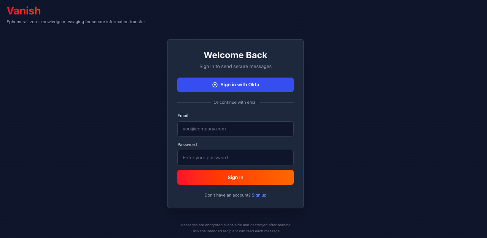
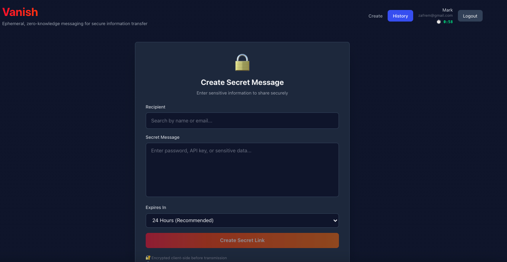
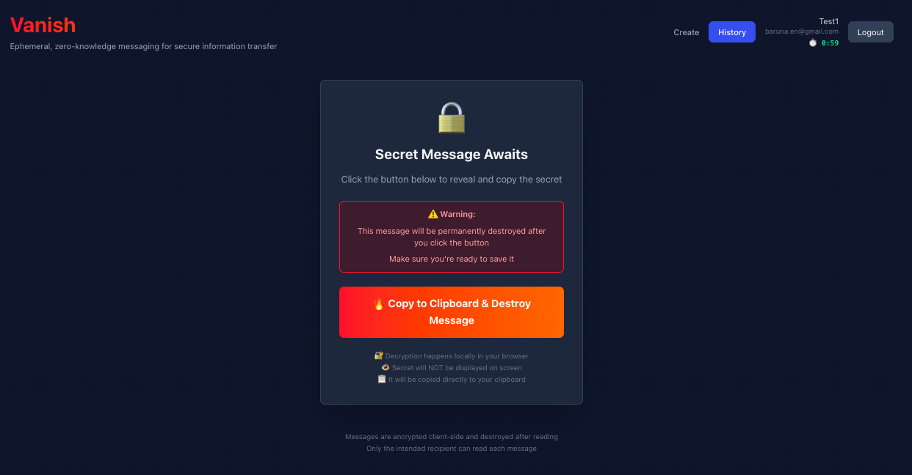

<div align="center">
  
  <h1>Vanish</h1>
</div>

> An ephemeral messaging platform designed for secure, single-use information transfer.

Welcome to **Vanish**, a secure messaging platform built for those times when you need to share sensitive information—like passwords, API keys, or certificates—without leaving a digital trail.

Vanish operates on a zero-knowledge architecture, which means the server never sees your data in plain text. Your messages are encrypted right on your device (client-side) before they even touch the network. They are stored briefly in volatile memory and are permanently destroyed the moment they are read. We designed this specifically for enterprise environments where security and privacy are paramount.

## Why Use Vanish?

*   **Zero-Knowledge by Design**: We can't see your secrets, and neither can anyone else. The server never handles plaintext data.
*   **Client-Side Encryption**: Your data is locked with AES-256-GCM encryption before it leaves your browser.
*   **Burn-on-Read**: Once a message is viewed, it's gone. Automatically and permanently destroyed.
*   **Clipboard Protection**: To prevent accidental leaks, secrets are copied directly to your clipboard instead of being displayed in the DOM.
*   **Truly Ephemeral**: We use Redis for in-memory storage, ensuring no data is ever written to a persistent disk.
*   **You're in Control**: Set a time-to-live (TTL) for your messages, ranging from 1 hour to 7 days.

## Quick Start Guide

Getting started with Vanish is straightforward. You can run it locally for development or deploy the full suite of services using Docker.

### Prerequisites

Before you begin, make sure you have the following installed:
*   **Docker** and **Docker Compose**
*   *(Optional)* **Go 1.21+** and **Node.js 20+** if you plan to do local development without Docker.

### Using the Start Scripts

We've included handy scripts to help you manage the application lifecycle.

**For Development:**
If you want to run the Go backend and Vite frontend locally with hot-reloading:
```bash
./start.sh dev
```

**For Production-like Environment:**
To spin up all services (Frontend, Backend, Postgres, Redis, Vault) in Docker containers:
```bash
./start.sh docker
```

**Stopping the Application:**
When you're done, you can shut everything down easily:
```bash
./stop.sh dev     # Stops the local dev environment
./stop.sh docker  # Stops the Docker containers
./stop.sh all     # Stops everything
```

### Manual Start (Docker Compose)

If you prefer using Docker Compose directly, you can start all services with a single command:

```bash
docker-compose up -d
```

Once everything is running, you can access the application at **http://localhost:3000**.

### Docker Image Management

To build and push your own Docker images to a registry:

```bash
# Build the unified image (Backend + Frontend)
docker build -t zafrem/vanish:tagname .

# Push the image to Docker Hub
docker push zafrem/vanish:tagname
```



**Service Endpoints:**
*   **Frontend**: [http://localhost:3000](http://localhost:3000)
*   **Backend API**: [http://localhost:8080](http://localhost:8080)
*   **PostgreSQL**: `localhost:5432`
*   **Redis**: `localhost:6379`
*   **Vault** (optional): [http://localhost:8200](http://localhost:8200)

### Local Development Setup

If you want to contribute or modify the code, here's how to run the backend and frontend services individually.

**1. Backend Setup**
Navigate to the backend directory, set up your environment, and start the server:
```bash
cd backend
cp .env.example .env
docker-compose -f ../docker-compose.dev.yml up -d redis  # We need Redis running
go run cmd/server/main.go
```

**2. Frontend Setup**
In a new terminal window, get the frontend running:
```bash
cd frontend
npm install
npm run dev
```

## Visual Walkthrough

See Vanish in action:

### 1. The Dashboard
Your central hub for managing secure communications.


### 2. Send a Secure Message
Compose your message, set an expiration time, and choose a recipient.


### 3. Share the Link
The recipient receives a secure, one-time-use link.


### 4. Track History
Monitor the status of your sent messages (Read, Pending, or Expired).


## Technology Stack

Vanish is built on a modern, robust stack designed for performance and security:

*   **Backend**: Go 1.21, Gin Web Framework, Redis 7, PostgreSQL 15
*   **Frontend**: React 18, Vite, Tailwind CSS, Web Crypto API

## Documentation

We have detailed documentation available to help you get the most out of Vanish:

*   **[API Reference](docs/API_REFERENCE.md)**: Explore the complete API documentation.
*   **[Architecture](docs/ARCHITECTURE.md)**: Deep dive into the system design and security model.
*   **[Deployment Guide](docs/DEPLOYMENT.md)**: Instructions for deploying Vanish to production.
*   **[Enterprise Setup](docs/ENTERPRISE_SETUP.md)**: Integrations for Okta, Vault, Slack, and Email.
*   **[Configuration](docs/CONFIGURATION.md)**: Learn about environment variables and settings.
*   **[Testing](docs/TESTING.md)**: How to run the test suite.

## Security Notice

**⚠️ Important:** While Vanish uses client-side encryption and ephemeral storage, please remember that no system is perfect.
*   Recipients could still take a photo or screenshot of the message.
*   If a recipient's device is compromised, the data could be at risk.
*   Social engineering attacks are always a possibility.

Please use Vanish as part of a broader security strategy.

## License

Vanish is open-source software. See the [LICENSE](LICENSE) file for more details.
